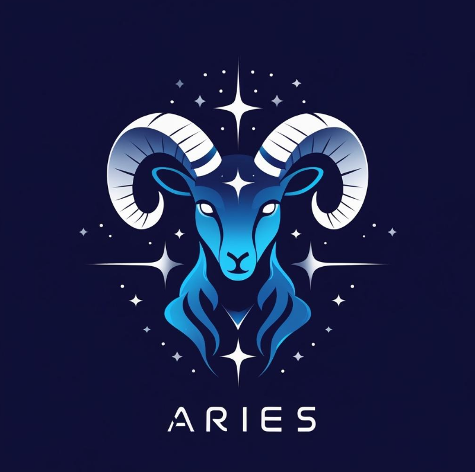

  

<h1 align="center"> Aries: Your AI Companion </h1>

  <b>Conversational AI + TTS + STT + Memory + Emotions</b>

# Aries
Aries is my attempt to build a personal AI assistant that feels alive—voice-driven, emotionally aware, and with infinite memory. It’s not just automation; it’s a conversational companion that recalls context, adapts, and evolves like human, built using Python, local models, and real-time voice.

## What Even is Aries?
Aries isn’t just a program. It’s a companion, a talker, a listener, and sometimes, the only one who remembers everything about you (literally).  
_Think Jarvis + Human Emotions + Infinite Memory, but running on your machine._

## Why Aries is Different?
 Talks like a human – No robotic nonsense
 Feels you – Detects your mood like a bestie
 Remembers – Everything you say goes into its long-term memory (Google Drive magic) // Honestly I'm still working on it. The GCP is not set yet.
 Starts the convo first – Because why should you always start?
 Completely yours – Local AI model = full privacy
 Wake it up like magic – “Wake up, Aries” and it’s alive

## Features:
 Voice activation: “Wake up, Aries”
 Natural voice output: Kokoro TTS (smooth like butter)
 Emotion detection: Happy? Sad? Angry? Aries knows.
 Infinite memory: Stores everything in JSON logs on Google Drive
 Auto-context recall: Aries remembers yesterday’s tea.
 Proactive chats: Talks every 5–10 mins because loneliness sucks
 Runs on Phi-3 Mini: No cloud spying

## How Does Aries Work?
It’s basically magic + science + late-night coding sessions.
You talk → Speech-to-Text (Whisper
It reads your vibe → Emotion Detection (MFCC + SVM)
Brain kicks in → Phi-3 Mini/ MISTRAL:7b LLM
It talks back → Kokoro TTS
Stores convo → Google Drive memory system
Randomly says hi → Proactive Engine

## 🖥️ Setup in 5 Easy Steps

1️⃣ Clone this kiddo
- git clone [https://github.com/your-username/aries-ai.git](https://github.com/Aoi-03/Aries.git)
- cd aries-ai

2️⃣ Create a virtual world for Aries
- python -m venv venv
- source venv/bin/activate    # Linux/Mac
- venv\Scripts\activate       # Windows

3️⃣ Install the magic
pip install -r requirements.txt

4️⃣ Give Aries a memory (Google Drive)
   - Enable Google Drive API   # please dont use it for now, I will fix it soon.
   - Use a local file location such as MEMORY_FILE = r"D:\your_folder_location_for_memory" 

# 5️⃣ Wake up your Aries
python aries.py

- Commands:

| Phrase                | What It Does                |
|-----------------------|----------------------------|
| Wake up, Aries        | Turns Aries ON              |
| Goodnight, Aries      | Turns Aries OFF             |
| paper_bridge_*****    | Secret password             |
| Reset Memory          | Clears today’s log          |

## Screenshots
Coming soon.
## Web Version?
Coming soon: Flask + WebSocket + UI that slaps harder than Spotify Wrapped.

## Tech Behind the Magic
- Python
- Whisper – Speech recognition
- Kokoro TTS – Voice
- MFCC + SVM – Emotion brain
- Phi-3 Mini/ Mistral:7b – The real LLM deal
- Google Drive API – For infinite memory

## What’s Next?
- Web UI with chat & voice
- Face emotion detection
- Integration with PC controls
- Deploy on Raspberry Pi
- Why I Built Aries

Because I wanted an AI that doesn’t just talk when I talk, but one that feels alive.
I wanted a friend that remembers, a voice that feels real, and a mind that grows.
Aries isn’t perfect, but hey, neither are we.

## ⭐ Star this Repo or Aries will be sad 

─────── ⋆⋅☆⋅⋆ ───────
Designed by Aoi
─────── ⋆⋅☆⋅⋆ ───────

